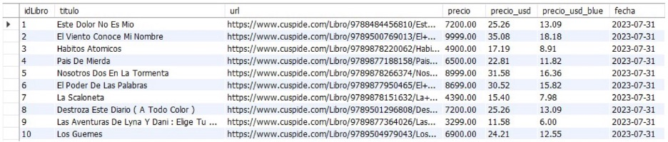
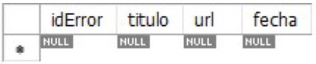

<br>
</br>

#  **<p align="center">Books - Web Scraping & MySQL Database</p>** 


# <p align="center">Unlocking Book Market Insights: Web Scraping & Data Mastery for Top 100 Bestsellers</p>

## *1. Introduction & Context*

In the context of this project, we are tasked with conducting web scraping on the Cúspide Libros website, www.cuspide.com, in order to retrieve a list of the 100 best-selling books of the week. The specific data points that need to be collected include:

- Title of the book.
- URL of the book.
- Price in Argentine Pesos (ARS).
- Price in US Dollars (USD).
- Price in Euros (EUR).
- Date of data extraction.

To ensure the accuracy of the information, we will also scrape the current exchange rate in Euros from a website of our choice. This exchange rate will be used to convert the prices from Argentine Pesos (ARS) to US Dollars (USD) and Euros (EUR).

Furthermore, as part of this data collection process, we will be ingesting the scraped data into a MySQL database. This database will have two tables:

**1. Main Table:** This table will store the scraped data, including the title of the book, URL, prices in Argentine Pesos (ARS), US Dollars (USD), and Euros (EUR), as well as the date of extraction.

**2. Error Audit Table:** In case any book title cannot be scraped due to unforeseen issues or errors, an error audit table will be created to log these instances for later analysis and troubleshooting.

The primary goal of this project is to obtain, store, and update the list of the 100 best-selling books, along with their prices and exchange rate-adjusted prices, on a weekly basis. This information will be useful for tracking changes in book sales trends and prices over time. Additionally, it will help provide valuable insights into the book market in Argentina and facilitate data-driven decision-making.

The successful implementation of this web scraping and data storage project will enable us to maintain an up-to-date record of book sales and pricing, ensuring that our data remains relevant and reliable for various analytical and business purposes.


## *2. Code*

```python

# Establish the connection between SQL and Python

# Import the pymysql module for MySQL database interaction
import pymysql

# Set up a connection to the database server
with open('textos.txt') as archivo_claves:
    claves = [clave.strip() for clave in archivo_claves]

# Create a connection to the database using the credentials from 'textos.txt'
conexion = pymysql.connect( host = claves[0],
                            user = claves[1],
                            passwd = claves[2],
                            db = claves[3])


# Create a cursor object for executing SQL queries
cursor = conexion.cursor()

# Erase tables is exist
print('> We erase all the existing tables in the Database.')
sqlDropTable = "DROP TABLE IF EXISTS libro;"
sqlDropTable2 = "DROP TABLE IF EXISTS audit_libro;"
cursor.execute(sqlDropTable)
cursor.execute(sqlDropTable2)

#Crea tablas
print('> We create both tables to insert the results.')
sqlCreateTable = """CREATE TABLE IF NOT EXISTS libro (
	IdLibro  	INT AUTO_INCREMENT,
    Titulo    	VARCHAR(100),
    URL       	VARCHAR(300),
    PrecioARS	FLOAT,
    PrecioUSD	FLOAT,
    PrecioEUR	FLOAT,
    Fecha		TIMESTAMP,
    PRIMARY KEY(IdLibro)
);"""
sqlCreateTable2 = """CREATE TABLE IF NOT EXISTS audit_libro (
	IdError  	INT AUTO_INCREMENT,
    Titulo    	VARCHAR(100),
    URL       	VARCHAR(300),
    Fecha		TIMESTAMP,
    PRIMARY KEY(IdError)
);"""
cursor.execute(sqlCreateTable)
cursor.execute(sqlCreateTable2)

# Now we perform web scraping

# Import necessary libraries for web scraping
import requests
from bs4 import BeautifulSoup
import numpy as np
import datetime
import time

# Get the HTML code of the page and store it in the 'page' variable
page = requests.get('https://www.cuspide.com/cienmasvendidos').text

# Parse the HTML code using the 'html.parser' instruction of BeautifulSoup
soup = BeautifulSoup(page,"html.parser")

# Find and store all 'Article' sections in the 'articles' variable
articles = soup.find_all('article')

# Loop through a subset of articles and extract data
for article in articles[:2]:
    titulo = article.find('a')['title']
    url = 'https://www.cuspide.com' + article.find('a')['href']

    # Access each URL to obtain prices
    page1 = requests.get(url).text

    # Parse the HTML code of the page using 'html.parser' of BeautifulSoup
    soup1 = BeautifulSoup(page1,"html.parser")

    # Find the div containing the prices
    price_div = soup1.find('div', class_='md-precio')

    # Find all div elements within the price div
    price_elements = price_div.find_all('div', class_='precio')

    # Get the text from the div elements and extract prices in AR$ and US$
    ar_price = price_elements[0].find('div').get_text(strip=True)
    us_price = price_elements[0].find('div').next_sibling.get_text(strip=True)

    # Convert text to float numbers
    ar_priceNum = ar_price[3:]
    ar_priceNumFloat = ar_priceNum.replace('.','')
    ar_priceNumFloat = float(ar_priceNumFloat.replace(',','.'))
    
    us_priceNum = us_price[3:]
    us_priceNumFloat = float(us_priceNum.replace(',','.'))

    # Store prices in variables
    precioARS = ar_priceNumFloat
    precioUSD = us_priceNumFloat

    # EURO PRICE
    # Extract the EURUSD conversion from the given page
    # https://www.forbes.com/advisor/money-transfer/currency-converter/eur-usd/

    # Get the HTML code of the page and store it in the 'page2' variable
    page2 = requests.get('https://www.forbes.com/advisor/money-transfer/currency-converter/eur-usd/').text

    # Parse the HTML code using 'html.parser' of BeautifulSoup
    soup2 = BeautifulSoup(page2,"html.parser")

    # Find the div containing the exchange rate
    precioEUR = round(precioUSD*float(soup2.find('div', class_='hero-template_content').strong.get_text(strip=True)[8:15]),2)

    # Get the current date and time as a TIMESTAMP
    today = datetime.date.today()
    t = time.localtime()
    current_time = time.strftime("%H:%M:%S", t)
    fecha = str(today)+' '+ str(current_time)

    # Create an INSERT statement to insert data into the MySQL 'libro' table
    cursor.execute("INSERT INTO libro(Titulo,URL,PrecioARS,PrecioUSD,PrecioEUR,Fecha) VALUES (%s,%s,%s,%s,%s,%s);",(titulo,url,precioARS,precioUSD,precioEUR,fecha))

# Commit the changes to the database and close the connection
conexion.commit()
conexion.close()

# Print extracted data for the last article (outside the loop)
print(titulo)
print(url)
print(precioARS)
print(precioUSD)
print(precioEUR)
print(fecha)


```

## *3. Results*

### *3.1. Books Table:*

We can see that all books were succesfully saved into the database:

<p align="center">
  
</p>

We can see that there is information regarding every video game that can give us an idea its general description. also, we can check that the columns 'genres', 'tags' and 'specs' have lists with the features that apply for each videogame. In other words, one videogame can have a diversity of genres, tags and specs, and the company organizes that information into lists. 

### *3.2. Errors Table:*

Also, it is evident that there were no errors in the webscrapping operation:

<p align="center">
  
</p>


## *4. Conclusions*

This web scraping and MySQL database project aimed to collect and store data on the 100 best-selling books in the Cúspide Libros website on a weekly basis. After conducting the web scraping and implementing the data storage process, we can draw the following conclusions:

- **Successful Data Collection:** The web scraping process successfully extracted data from the Cúspide Libros website, including book titles, URLs, prices in Argentine Pesos (ARS), US Dollars (USD), and Euros (EUR), along with the date of extraction. This information has been consistently and accurately collected.

- **Error-Free Execution:** The absence of entries in the Error Audit Table indicates that the scraping process encountered no errors or issues, ensuring the reliability of the data collection process.

- **Data Organization:** The MySQL database has been effectively set up with two tables, the Main Table, and the Error Audit Table. This structured data storage allows for organized record-keeping of book sales data and any potential issues that may arise during the scraping process.

- **Currency Conversion:** The project successfully incorporated a currency conversion mechanism to convert prices from ARS to USD and EUR using real-time exchange rates obtained from Forbes. This feature enhances the usability and value of the collected data for analysis.

- **Automation:** The project does not currently include automation for weekly data collection, but this can be achieved by scheduling the script to run periodically.


## *5. Recommendations*

To further enhance and optimize this project, here are some recommendations:

- **Automation:** Implement an automated schedule to run the web scraping script on a weekly basis. This will ensure that the database remains up-to-date and requires minimal manual intervention.

- **Error Handling:** While no errors were encountered during the initial data collection, it's advisable to implement robust error handling and logging mechanisms to capture and address any potential issues in the future.

- **Data Visualization:** Develop data visualization and reporting tools to present the collected data in a more user-friendly and insightful manner. Graphs, charts, and trends can be generated to analyze the book market.

- **User Interface:** Create a user interface that allows non-technical users to query and extract specific data from the database, making it accessible for a wider audience within the organization.

- **Data Retention Policy:** Establish a data retention policy to manage the storage of historical data. Decide how long to keep previous weeks' data and when to archive or delete it to maintain a manageable database size.

- **Security and Privacy:** Ensure that any sensitive or personal data, if collected, is handled with the utmost security and in compliance with data privacy regulations.

- **Regular Maintenance:** Regularly monitor and maintain the web scraping script, as websites may change their structure or layout, which could break the scraping process. Periodic updates are necessary to adapt to such changes.

- **Scaling:** If the project's scope expands or if more websites need to be scraped, consider the scalability of the infrastructure and ensure that it can handle the increased workload.

By implementing these recommendations, the project can evolve into a powerful tool for tracking book market trends and making informed decisions based on real-time data.

## *6. Requirements*

**1. Python**
- Requests
- BeautifulSoup
- Numpy
- Datetime
- Time
- Pymysql

**2. MySQL**

**3. MySQL Workbench**


## *7. Author*

- **Juan Camilo Grisales López**
- Mail: grisales1803@gmail.com
- Linkedin: [https://www.linkedin.com/in/grisales1803/](https://www.linkedin.com/in/grisales1803/)
